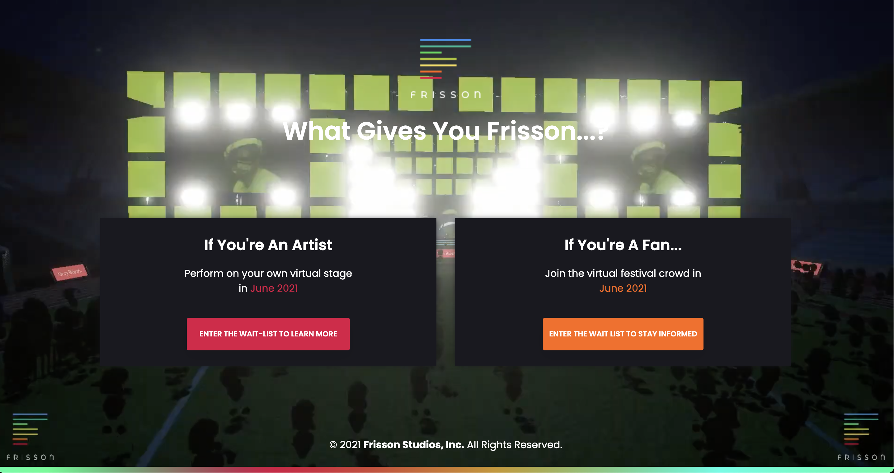

# [React Landing Page Sign Up](https://github.com/vikoperdomo/landing-reactjs )  



## Landing Page to host two data forms FANS & ARTIST

Emails will be hosted on Sendgrid, on two different contact lists using API calls to send the information.

### Fans

1. Title: If you're A Fan...
2. Sub-title: Join the virtual festival crowd in June 2021
3. CTA "Enter the wait list to stay informed"
4. Fans will need only an email

###  ARTIST

1. Title: If you're An Artist
2. Sub-title: Perform on your own virtual stage in June 2021
3. Artists need a custom form with these input values:
   - Artist Name
   - Music Profile Link
   - Email
   - Comments
4. CTA "Enter the wait list to learn more"

### Quick start

1.  Download the project's zip || git checkout 
2.  Make sure you have node.js (<https://nodejs.org/en/>) installed
3.  Type `npm install` in terminal/console in the source folder where `package.json` is located
4.  You will find all the branding colors inside `src/assets/scss/style.cscs`. And you can change check the css structure here.
5.  Run in terminal `npm start`.

### File Structure

Within the download you'll find the following directories and files:
```
frisson-live
.
├── CHANGELOG.md
├── LICENSE.md
├── README.md
├── jsconfig.json
├── package.json
├── public
│   └── _redirects
│   ├── favicon.ico
│   ├── index.html
│   └── manifest.json
│   └── robotss.txt

└── src
    ├── index.js
    ├── App.js
    ├── assets
    │   ├── css
    │   ├── fonts
    │   ├── img
    │   ├── scss
    ├── components
    ├── container
    ├── data
    ├── layouts
    ├── theme
```

## Browser Support

At present, we officially aim to support the last two versions of the following browsers:

    

